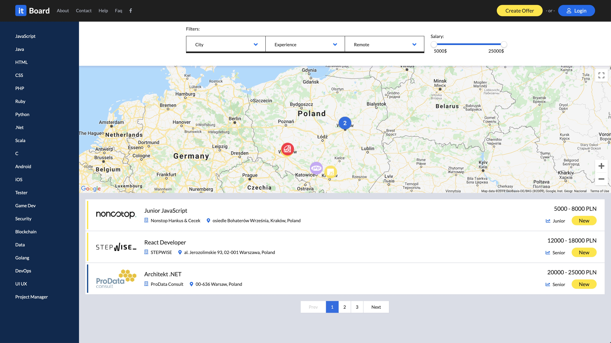

# Justjoin.it clone

[Check online version](https://it.jarchiwum.pl/) 

Main goal was to build fullstack app in JS from scratch to practice user authentication and server side rendering. 

This repository is only for frontend part of application. Rigth now backend is private, if you would like to check it please contact me.

App and Databse are hosted on [Vultr](https://www.vultr.com/)

## Frontend

For frontend i use NextJS framework which allows me to build universal app with React, which benefits with better SEO and first rendering time than SPA and users can share links to offers on social media platforms and gets correct Open Graph tags for each offer ex.:

## Backend

For backend part of app i choose to use ExpressJS with MongoDB, i want to practice user authentication, wich is based on JWT tokens passed to client in two cookies where one is http only, to read more check [this article](https://medium.com/lightrail/getting-token-authentication-right-in-a-stateless-single-page-application-57d0c6474e3).

Backend is also responsible things like:

* Generating social media cards with [Jimp](https://www.npmjs.com/package/jimp)
* Emails handling with [Sendgrid](https://sendgrid.com/)

## Stack

* [NextJS](https://nextjs.org/)
* [Vultr](https://vultr.com/) 
* [NodeJS](https://nodejs.org/en/)
* [MongoDB](https://www.mongodb.com/)
* [Vultr](https://vultr.com/)